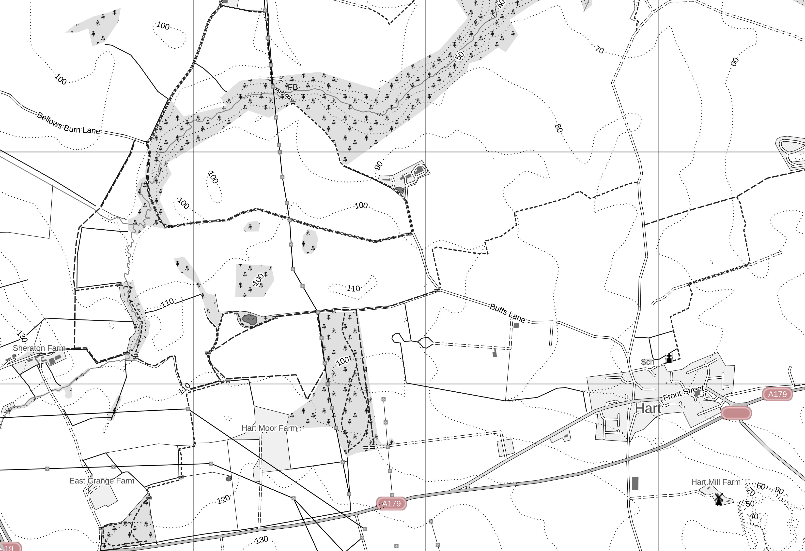

Readme
======
GB Leisure is a [CartoCSS](http://wiki.openstreetmap.org/wiki/CartoCSS) style intended for use with [OpenStreetMap](http://www.openstreetmap.org) data, OS OpenData [Terrain 50 contour shapefiles](http://www.ordnancesurvey.co.uk/business-and-government/products/terrain-50.html) and Charles Roper's [OSGB 1km grid shapefile](https://github.com/charlesroper/OSGB_Grids).

The style is still very much a work in progress and is currently missing a number of important features. However, the aim is to produce a map style that can be used for outdoor activities (walking, hiking, mountain biking, etc.) in Great Britain that shows features relevant to these activities (including public rights of way defined in the [OpenStreetMap](http://www.openstreetmap.org) database by the [designation](https://wiki.openstreetmap.org/wiki/Designation) tag) and uses the [Ordnance Survey (OSGB 1936) projection (EPSG:27700) and British National Grid](http://en.wikipedia.org/wiki/Ordnance_Survey_National_Grid).

Files
-----
- The project.mml and style.mss files were created using TileMill
- project-mono.mml and style-mono.mss are a monochrome version intended for
  black and white printing, or use as a background to show routes in colour
  etc.
- The generate-xml.sh BASH script uses carto to generate a Mapnik XML file and sed to replace the TileMill default projection with the OSGB one
- The print-osgb.py Python script uses Mapnik to render a map which uses the OSGB projection using a given paper size, scale and origin (specified using an OS all-numeric grid reference). It could also be used to render alternative Mapnik styles in a similar fashion

Requirements
------------
- Mapnik
- carto
- TileMill (optional but useful for editing)
- A PostGIS database of some OpenStreetMap data including the designation tag
- Charles Roper's [OSGB 1km grid shapefile](https://github.com/charlesroper/OSGB_Grids)
- OS OpenData [Terrain 50 contour shapefiles](http://www.ordnancesurvey.co.uk/business-and-government/products/terrain-50.html) for the relevant area (N.B. two or more can be merged using ogr2ogr)

Usage
-----
Basic usage is as follows:
- Install Mapnik, carto, PostGIS and optionally TileMill
- Download the files from this repository
- Download/extract the [OSGB 1km grid shapefile](https://github.com/charlesroper/OSGB_Grids) and [Terrain 50 contour shapefiles](http://www.ordnancesurvey.co.uk/business-and-government/products/terrain-50.html)
- Download some [OpenStreetMap data](http://download.geofabrik.de/europe/great-britain.html) and load it into PostGIS using osm2pgsql. You may need to modify the osm2pgsql style file to include the designation tag (used for proper rendering of public rights of way)
- Edit the project.mml file to provide the correct database name (default 'gis') and paths for the files you downloaded
- Set options in the generate-xml.sh script and run it to convert the CartoCSS files into a Mapnik XML file
- Set options in the print-osgb.py script and run it to create a PNG image

Licences
-------
This is based on the work of Greg (gregrs-uk) (https://github.com/gregrs-uk/gb-leisure-carto/)

It includes code samples and icons from Andy Townsend's OpenStreetmap Carto Style (https://github.com/SomeoneElseOSM/openstreetmap-carto-AJT).

Feel free to use this code in your own projects (see LICENCE file for details) but please provide attribution and (where possible) a link to https://github.com/gregrs-uk/gb-leisure-carto/ in your code and alongside any map renders.
